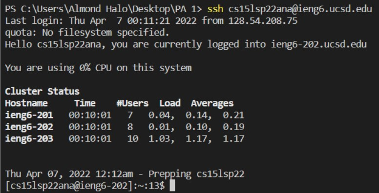
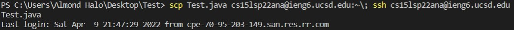

# Lab 1 Report

## How To Log Into ieng6

### **Step 1:** *Installing VSCode*

In the case you haven't installed VSCode, you may do so using this link: [Download Visual Studio Code](https://code.visualstudio.com/)

1. Download the IDE specific to your platform

2. Open and allow the code to make the proper changes to your device

### **Step 2:** *Remotely Connecting*

To connect remotely to a host, run the specific commands listed below.

1. Open PowerShell.

2. Run the 'ssh' command followed by your 'username' + '@' + 'host' (ieng6.ucsd.edu) 

   Ex : ssh 'cs15lsp22zz@ieng6.ucsd.edu'

### The following graphic should appear:

### **Step 3:** *Trying Some Commands*

At this point, you'll be able to input commands into the terminal, the following are some you can try:

1. ls: Prints out the list of files.

2. cd: Change directory.

3. cd ~: Reverts to home directory.

4. ls '<'directory'>': Where the inputed directory is another group members username

    Here is an example:

### **Step 4:** *Moving Files with scp*

Now try using the specific command 'scp'. This will copy a given file to a given user in a host.

1. From the client, enter in 'scp' followed by the file to be copied followed by the 'username' + '@' + 'host'. Following the 'scp' command, this should be the same as in Step 2.

### **Step 5:** *Setting an SSH Key*

Forewarning, this might be the most conceptually difficult step.

1. Return to the home directory (use cd ~).

2. Use the command 'ssh-keygen' (Standing for "key generation").

3. Make sure to not input any Passphrase. Hit enter when prompted for input.

    * This will create a private and public key. From here, use the public key (saved in the file 'id_rsa.pub')

4. Now log back onto the server and use the command 'mkdir .ssh'

5. Again, return to the directory and input 'scp /Users/'User Name'/.ssh/id_rsa.pub cs15lsp22zz@ieng6.ucsd.edu:~/.ssh/authorized_keys'

From here forward you should be able to log into the server without having to input your password.

### **Step 6:** *Optimizing Remote Running*

To work the most efficiently, the programmer may use short-cuts to execute commands faster.

1. Use a ';' to make a chain of consecutive commands.

2. Also note that using the up/down arrows are far quicker than retyping each individual command. Cycle through past commands more easily.

