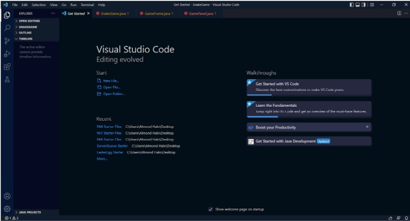
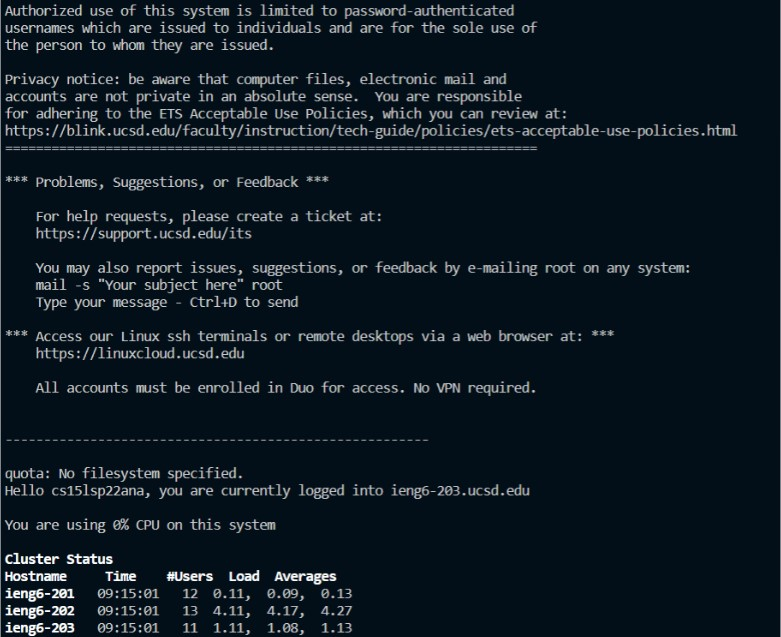
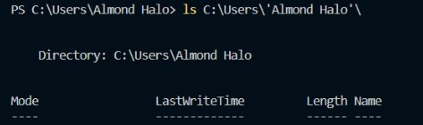
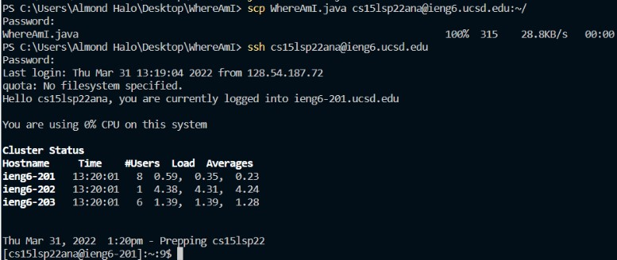

# Lab 1 Report

## How To Log Into ieng6

### **Step 1:** *Installing VSCode*

In the case you haven't installed VSCode, you may do so using this link: [Download Visual Studio Code](https://code.visualstudio.com/)

1. Download the IDE specific to your platform

2. Open and allow the code to make the proper changes to your device

### **Step 2:** *Remotely Connecting*

To connect remotely to a host, run the specific commands listed below.

1. Open PowerShell.

2. Run the 'ssh' command followed by your 'username' + '@' + 'host' (ieng6.ucsd.edu) 

   Ex : ssh 'cs15lsp22zz@ieng6.ucsd.edu'

### The following graphic should appear:

### **Step 3:** *Trying Some Commands*

At this point, you'll be able to input commands into the terminal, the following are some you can try:

1. ls: Prints out the list of files.

2. cd: Change directory.

3. cd ~: Reverts to home directory.

4. ls '<'directory'>': Where the inputed directory is another group members username

    Here is an example:

### **Step 4:** *Moving Files with scp*

Now try using the specific command 'scp'. This will copy a given file to a given user in a host.

1. From the client, enter in 'scp' followed by the 'username' + '@' + 'host'. Following the 'scp' command, this should be the same as in Step 2.

### **Step 5:** *Setting an SSH Key*

Forewarning, this might be the most conceptually difficult step.
1. 

### **Step 6:** *Optimizing Remote Running*

1. 

Image:

