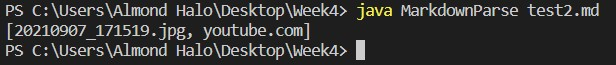
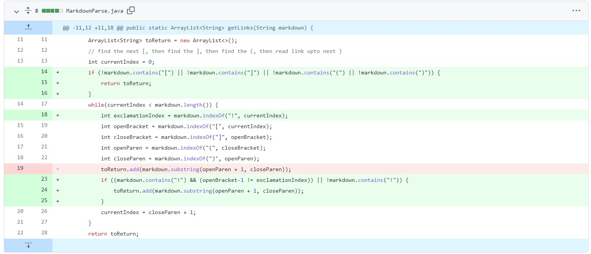
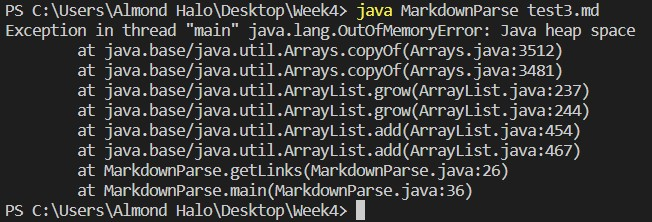
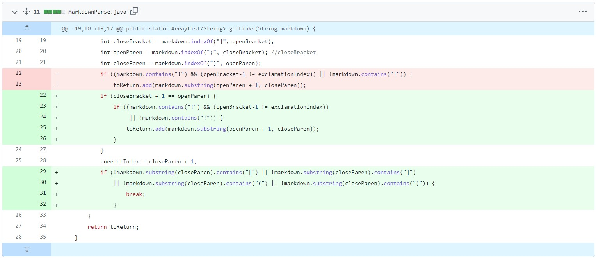
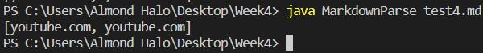

# Lab 3 Report
● Show a screenshot of the code change diff from Github (a page like this) X

● Link to the test file for a failure-inducing input that prompted you to make that change X

● Show the symptom of that failure-inducing input by showing the output of
running the file at the command line for the version where it was failing (this
should also be in the commit message history) X

● Write 2-3 sentences describing the relationship between the bug, the
symptom, and the failure-inducing input. X

## **MarkDownParse Bugs and Fixes**

### **Bug 1**

The bug (change shown on lines 23 - 25) is caused by how images share a similar syntax to hyperlinks. The program will return the image. Using the example code ([Markdown example 1](test2.md)) one may view the symptopm, the code considers images as instances of links, hence prints these out as well.

***Output Failure (jpg is still included):***

***Bug 1 fix:***

Fix description: The fix for this (lines 23 - 25) requires a check. Because the syntax for integrating images requires an exclamation mark, MarkdownParse doesn't add the given link if "!" is found before the opening bracket.

### **Bug 2**

The second bug (changes shown on lines 29 - 32) is caused by the while loop which never breaks. Therefore the symptom is an infinite loop. Check using ([Markdown example 2](test3.md)), the code will run until memory has run out of space for the while loop to continue. 

***Output Failure (loops until memory is out of space):***

***Bug 2 fix:***

Fix discriptioniscription: This fix checks after the final end parenthesis to see if their is another possible link. If not and the characters which make up the syntax for the link aren't found then the while loop breaks, ending the program, and returning the array as is.

### **Bug 3**

The third bug (changes shown on lines 22 - 26) is a algorithmic error. Here the code adds everything from the first "(" to the end ")" with no regard for whether the link is properly formated, so with an issue similar to the third example code ([Markdown example 3](test4.md)). 

***Output Failure (Adds links that haven't been properly formated in Markdown):***

***Bug 3 fix:***

Fix description: Before the changes (lines 22 - 26), 