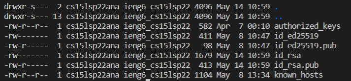
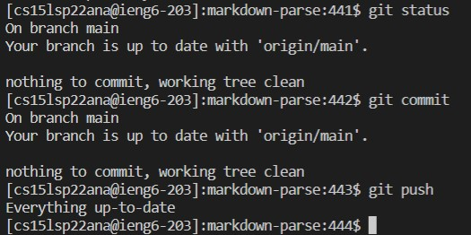

# Lab 5 Report

## **Streamlining ssh Configuration:**

Here, we create a config file which allows us to store the host name and user name. Through the config file, one is able to create a shorthand to log onto the host.

config file:


ssh with new alias:


scp file using alias:


## Githb Access From ieng6

After generating a key, the programmer is able to copy the key's contents to GitHub. Doing this should allow the programmer to push commits to their origin on GitHub.

Key location on GitHub:


Key location on local device:


Git commands:


Last commit:
[Link to last commit](https://github.com/AlmondHalo/markdown-parser/commit/68d4f1085ea3c0e4ed4c49e04ec1b670acea5a93)
## Copy Whole Directories with scp -r

Using ```scp -r```, the user is able to recursively copy an entire directory to a given server. This can be used as another way to copy a directory to a server in substitute of ```git clone```.

Format: ```scp -r . server@name:~/directoryName```

Copying markdown-parse through ```scp -r```:


Running tests after copy:


Copying and running tests:


