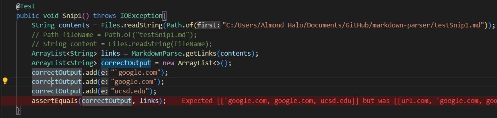
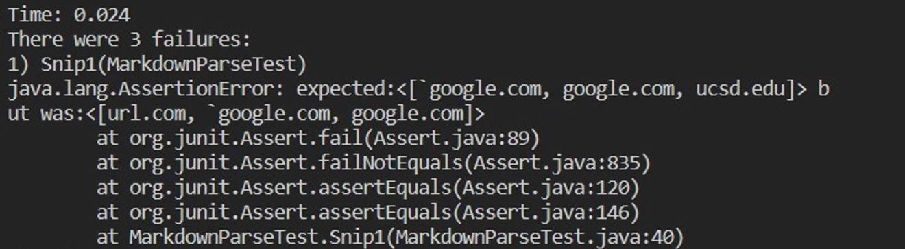
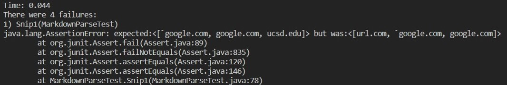
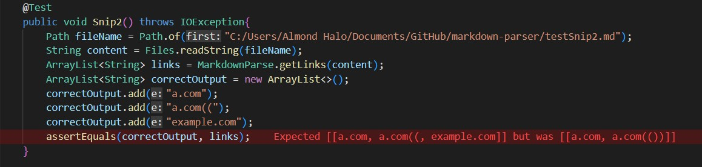
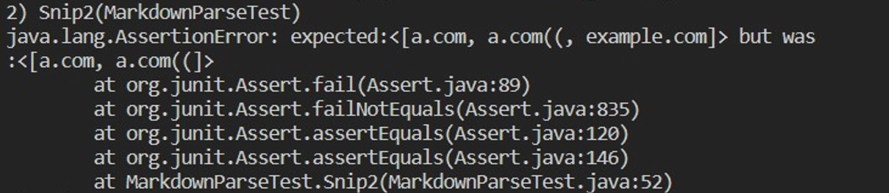
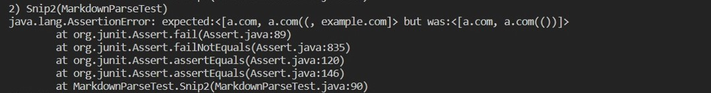
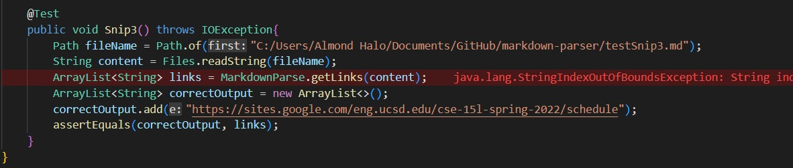
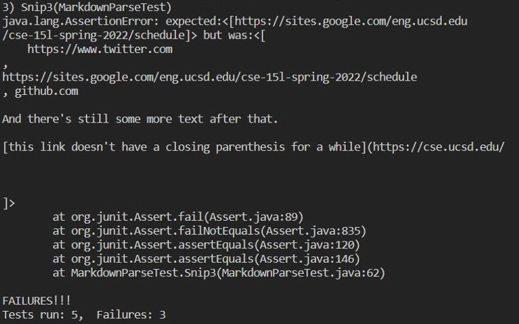
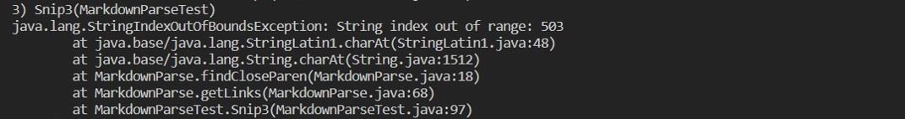

# Lab Report 7

## Test 1 

Implementation:



My Output:



**The test did NOT pass.**

Week 7 Output



**The test did NOT pass**

Fix:
To fix this issue, the program would have to identify quotation marks and see if the quoted text overlaps and falls outside or inbetween the bracket/parenthesis indicies. Doing would likely take less than 10 lines of code as the programmer would find the indices of each quotation mark and compare the indices to that of the brackets and quotes (which have already been found).

## Test 2

Implementation:



My Output:



**The test did NOT pass**

Week 7 Output:



**The test did NOT pass**

Fix:
To fix the issues shown in the tests above, the programmer would have to account for both nested brackets and parenthesis, (i.e. ```[ [ ] ]``` and ```( ( ) )```). Doing this would be longer than the <10 line stipulation because another method would be required to iterate through each line and tally how many open and closed brackets and parenthesis there are. 

## Test 3

Implmenetation:


 
My Output:



**The test did NOT pass**

Week 7 Output:



**The test did NOT pass**

Fix:
To fix the issues shown in the tests above, the programmer would likely have to account for how the code is spaced out across multiple lines. After having found the openning bracket/parenthesis, the programmer would have to create a for-loop or some other iterator to iterate through the following lines of text. If that text is interupted by an empty line, then the text cannot serve as a hyperlink and is therefore not an example of a link. Essentially the program would ignore the link in this instance.